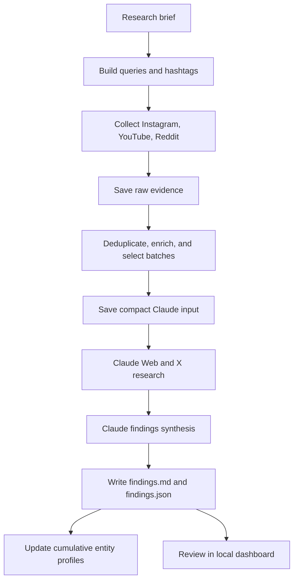

# Artist Discovery and Research

Artist Discovery is a file-based research system for finding Indian artists,
tracking their recent activity, and building evidence-backed profiles. It also
supports configurable movie-actor research across languages, markets, and
film industries.

The project is designed for discovery and research—not automated outreach. It
uses public information, preserves the evidence collected for each run, and
keeps uncertain claims clearly separated from confirmed findings.

## Objective

The system answers questions such as:

- Which singers, DJs, bands, comedians, dancers, speakers, influencers, and
  other artists are relevant for a location, category, and genre?
- Which candidates show measurable activity inside the recent research window?
- What official profiles, public booking links, and publicly listed contacts
  can be verified?
- Which movie actors are relevant to a selected language, market, or industry,
  and what current projects or activity support that conclusion?

Every research run produces both a readable report and structured JSON so the
results can be reviewed manually, displayed in the dashboard, or consumed by
future tooling.

## How it is implemented

The application is a small Python pipeline with a command-line runner and a
dependency-light local dashboard.

1. **Build the research brief**

   A request specifies the research kind (`artist` or `actor`), location or
   market, language, category, genre, refresh mode, and sources. The runner
   turns those inputs into deterministic search queries. Artist requests also
   select focused Instagram hashtags using the category, genre, and location.

2. **Collect direct-source evidence**

   - Instagram and YouTube are collected through Apify actors.
   - Reddit is collected through OAuth when credentials are available, with a
     public JSON fallback.
   - Web and X are queued for the Claude research phase.

   Direct collectors retain the complete raw response, deduplicate candidates,
   and select a bounded batch for enrichment. Previously processed profiles and
   Reddit posts are tracked so later runs can focus on new or refreshable data.

3. **Run Web/X research**

   When Web or X is selected, the runner gives Claude the saved direct-source
   evidence and research brief. Claude writes the Web/X evidence back into the
   run directory, including warnings when a source could not be accessed.

4. **Synthesize findings**

   A separate Claude phase reads the direct evidence and Web/X results. It
   writes a human-readable `findings.md` report and a structured `findings.json`
   file containing profiles, contacts, source yield, and warnings.

5. **Persist reusable profiles**

   Successful findings are merged into cumulative artist or actor profiles.
   Each entity keeps its current profile, activity snapshots, and source links,
   while each run remains available as an independent audit record.

6. **Review in the dashboard**

   The local dashboard launches new runs and displays source yield, candidate
   profiles, trend signals, contacts, warnings, raw evidence, and saved reports.

## Research flow



## Outputs

Generated data is stored locally under `outputs/`. These files are intentionally
ignored by Git because they can contain large research results and run-specific
data.

```text
outputs/
├── runs/
│   └── <YYYYMMDD_HHMMSS>/
│       ├── run_metadata.json          # Inputs, status, queries, source state
│       ├── apify_data.json            # Complete direct-source collector data
│       ├── claude_input.json          # Compact evidence sent to Claude
│       ├── web_data.json              # Web evidence, when Web is selected
│       ├── x_data.json                # X evidence, when X is selected
│       ├── web_research_prompt.md     # Prompt used for Web/X research
│       ├── research_prompt.md         # Prompt used for findings synthesis
│       ├── findings.md                # Readable final report
│       ├── findings.json              # Structured final findings
│       ├── progress.log               # Run-level progress log
│       └── *_claude_debug.log         # Claude diagnostics, when available
├── entities/
│   ├── artists/<slug>/
│   │   ├── profile.json               # Cumulative normalized profile
│   │   ├── activity.json              # Historical activity snapshots
│   │   └── sources.json               # Discovered source links
│   └── actors/<slug>/
│       ├── profile.json
│       ├── activity.json
│       └── sources.json
└── reddit_content_index.json          # Cross-run Reddit deduplication
```

The `hashtags/performance.json` file stores hashtag performance by research
context. It is used to balance proven hashtags with a small amount of
exploration in future artist runs.

### What the final report contains

Depending on the research kind and available evidence, findings can include:

- identity and biography;
- official profiles and source URLs;
- services, genres, filmography, or upcoming projects;
- dated videos, posts, news, and activity summaries;
- trend status and supporting evidence;
- publicly listed business or management contacts;
- source yield and warnings explaining gaps in the result.

The system does not infer missing contact details, dates, URLs, awards, or
metrics. A candidate without dated evidence is marked as discovered with trend
status unverified rather than being labelled trending.

## Setup

### Requirements

- Python 3.12 or newer is recommended.
- A Claude Code CLI installation that is authenticated for WebSearch and report
  generation.
- An Apify API token for Instagram and YouTube collection.
- Optional Reddit OAuth credentials.

### Local installation

```bash
python3 -m venv .venv
.venv/bin/pip install -r requirements.txt
cp .env.example .env
```

Add credentials to `.env` as needed:

```text
CLAUDE_CODE_OAUTH_TOKEN=...
APIFY_API_TOKEN=...
REDDIT_CLIENT_ID=...
REDDIT_CLIENT_SECRET=...
```

Keep `.env` private. It is excluded from Git.

## Run research from the command line

### Artist discovery

Artists require an L1 category and an L2 genre. For example:

```bash
.venv/bin/python main.py \
  --kind artist \
  --city Mumbai \
  --language Hindi \
  --category Singer \
  --genre Bollywood \
  --refresh-mode discovery \
  --sources instagram,youtube,web
```

### Actor research

Actor research can be broad or focused on a specific actor or movie:

```bash
.venv/bin/python main.py \
  --kind actor \
  --language Hindi \
  --market India \
  --industry Bollywood \
  --sources instagram,youtube,web,reddit,x
```

The runner prints the run directory when collection begins. Open that directory
to inspect the raw evidence, report, and logs.

## Run the dashboard

```bash
.venv/bin/python dashboard_server.py
```

Open <http://127.0.0.1:8780>. The dashboard can start artist or actor runs and
display both the latest snapshot and the complete run archive.

## Run with Docker

The container installs Python dependencies and the Claude Code CLI. Keep
credentials in `.env`, then run:

```bash
docker compose up -d --build
docker compose logs -f dashboard
```

Open <http://127.0.0.1:8780>. The compose file mounts `outputs/` and
`hashtags/` from the host so run history and hashtag performance survive
container rebuilds.

Stop the dashboard with:

```bash
docker compose down
```

## Refresh modes and source selection

- `discovery`: broad discovery and enrichment; the default.
- `trend`: prioritize recently refreshed candidates.
- `backfill`: refresh the known candidate set.

The research window for trend evaluation is fixed at 30 days. The default
sources are Instagram, YouTube, and Web. Reddit and X are optional and can be
added with `--sources`.

## Important limitations

- Results depend on the selected sources, API availability, rate limits, and
  the quality of public profiles.
- Web and X research requires the authenticated Claude CLI.
- A source failure is recorded in the run instead of silently treated as proof
  that no candidate exists.
- Run reports are not automatically merged with one another. Cumulative entity
  files are updated separately for longitudinal use.
- This V0 does not send email or WhatsApp messages, create public profiles, or
  persist data in a database.

## Project structure

```text
main.py                    # CLI entry point and run orchestration
dashboard_server.py        # Local dashboard and run launcher
collectors.py              # Source collection coordinator
source_collectors/         # Instagram, YouTube, Reddit, Web/X, Claude adapters
entity_profiles.py         # Cumulative artist and actor profile persistence
config.py                  # Research defaults, limits, and taxonomies
prompts/                   # Artist, actor, Web/X, and synthesis instructions
hashtags/                  # Hashtag selection and performance tracking
learnings/                 # Research guidance and operating notes
```
