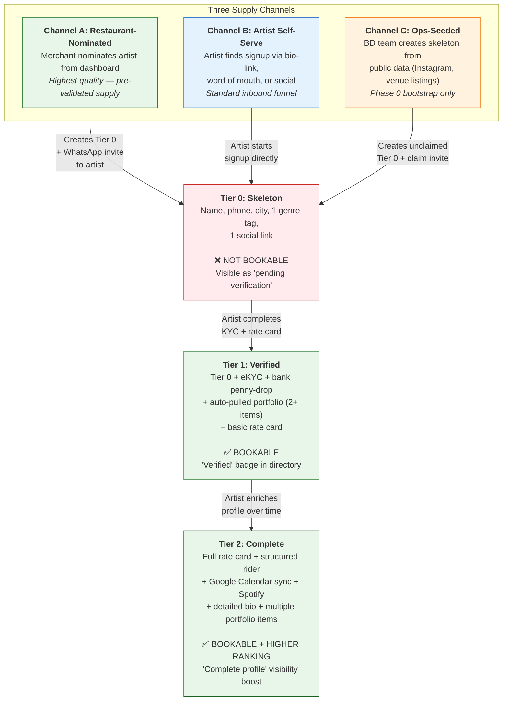
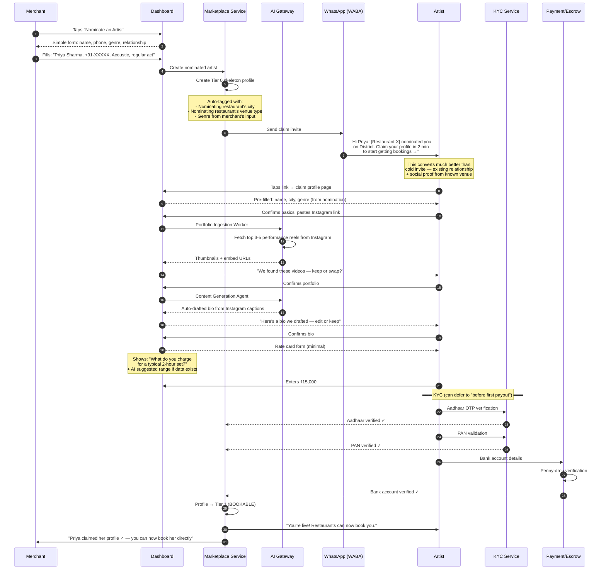
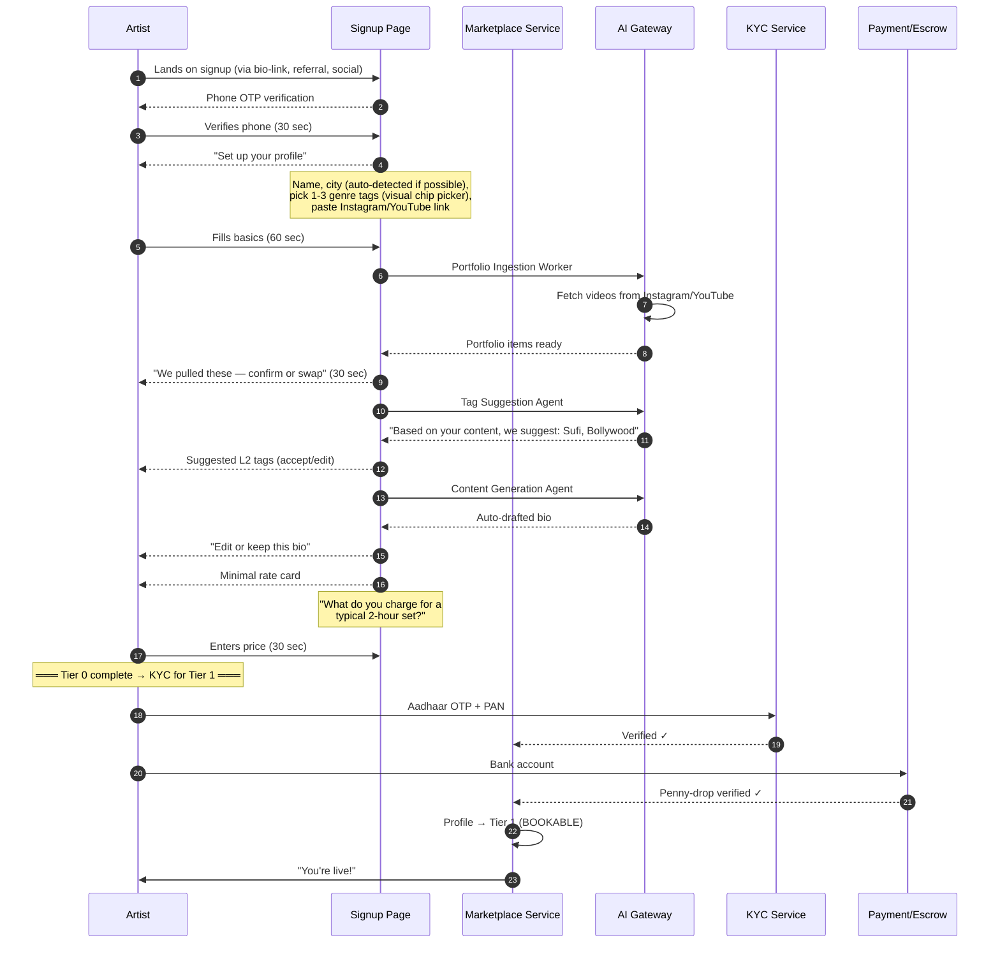
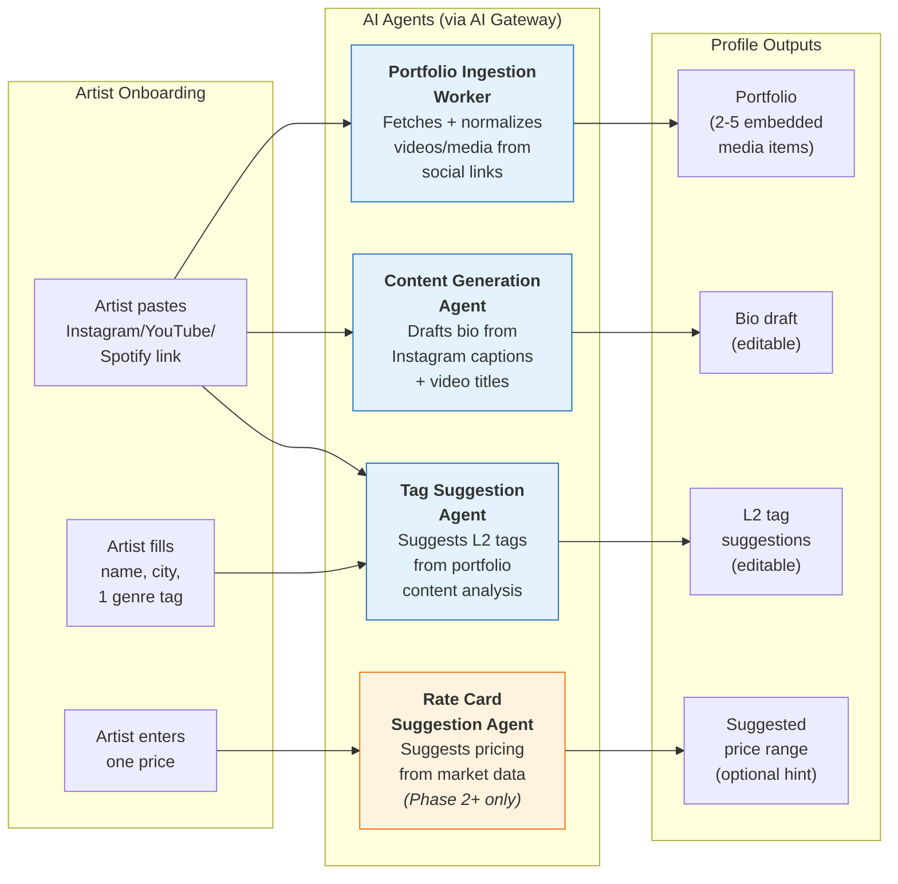
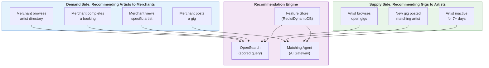
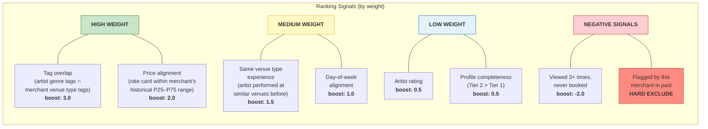
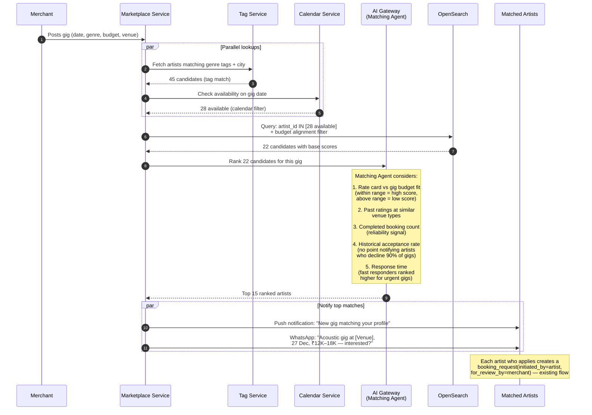
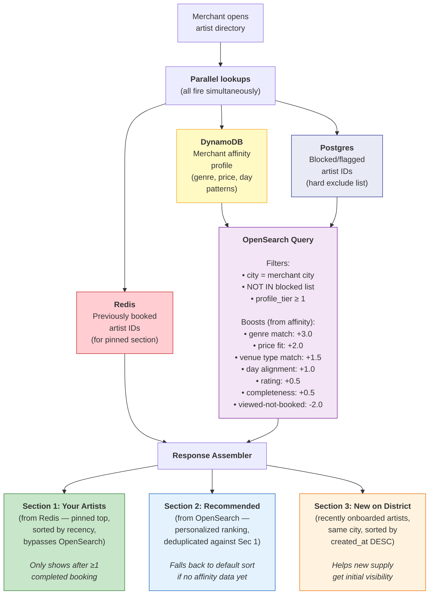

# Artist Onboarding & Matching/Recommendation — Visual Reference

---

## Part 1: Artist Onboarding

### 1.1 Three Onboarding Channels

### 1.2 Channel A Deep Dive: Restaurant-Nominated Flow

### 1.3 Channel B: Artist Self-Serve Flow

### 1.4 AI Agents in Onboarding

---

## Part 2: Matching & Recommendations

### 2.1 Two Directions of Matching

### 2.2 Artist-to-Merchant Matching: Ranking Signals

### 2.3 Gig-to-Artist Matching (Matching Agent)

### 2.4 Homepage Assembly Flow

