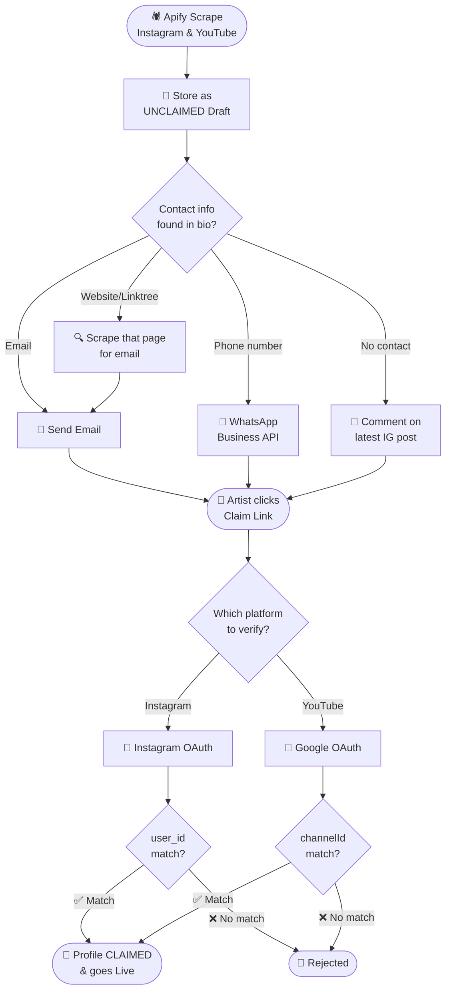
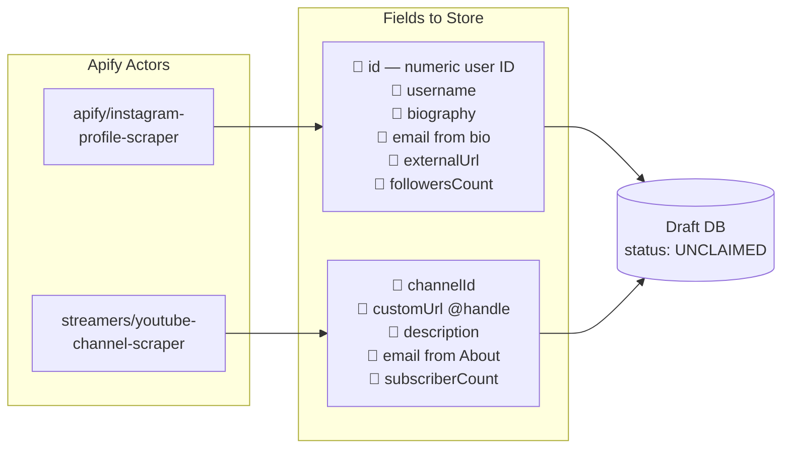
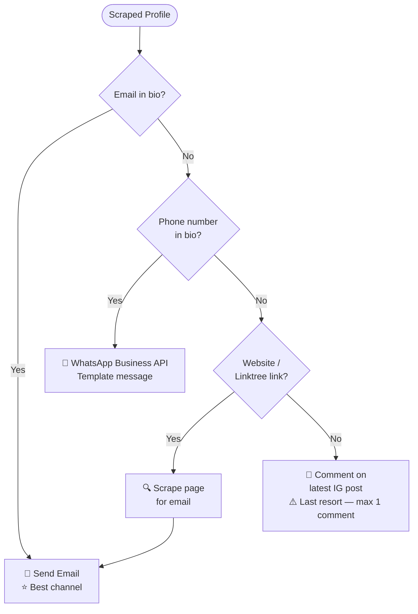
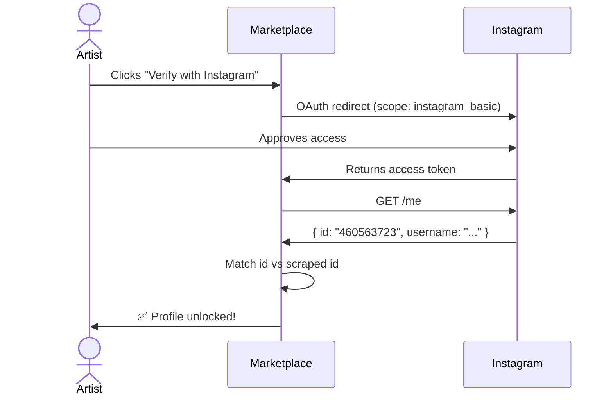
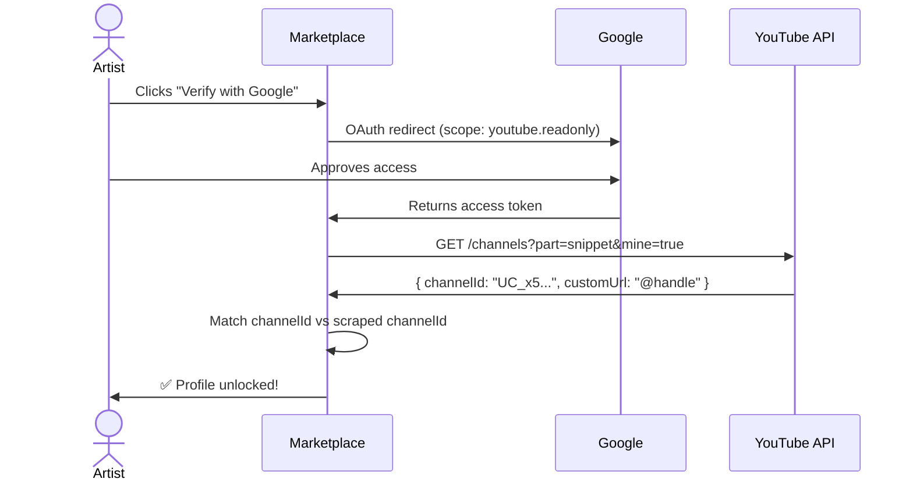
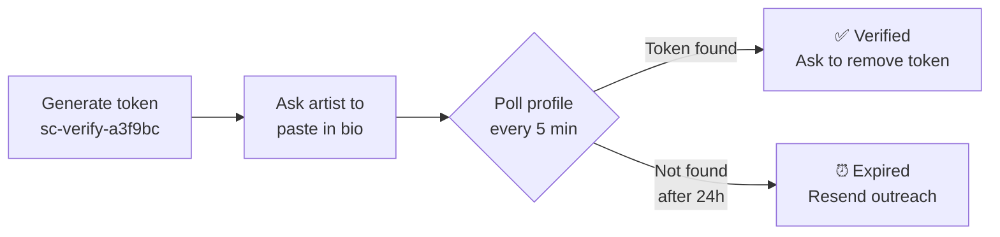
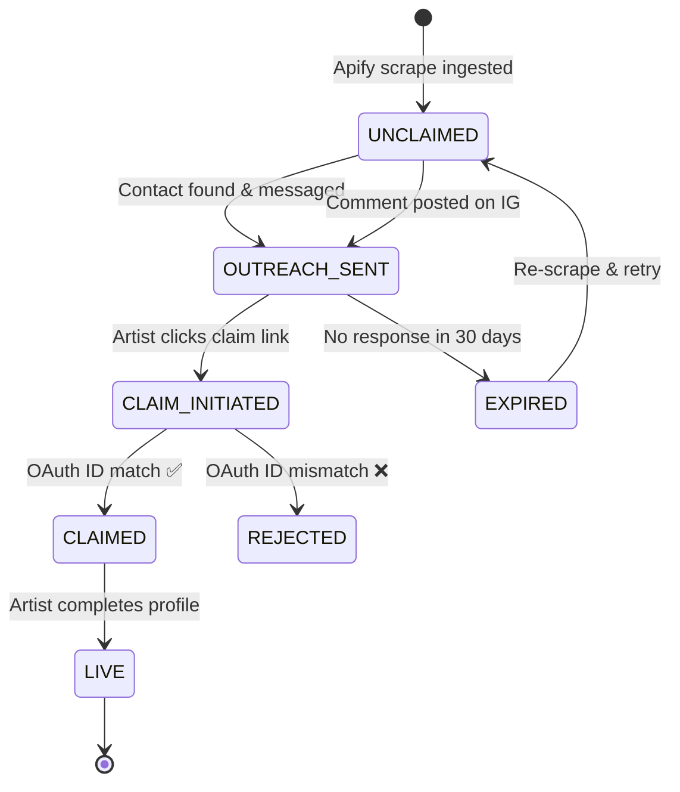

# 🎨 Artist Onboarding via Scraped Profiles

> Bootstrap artist supply without requiring self-onboarding.
> Extends the **existing restaurant Apify scraping pipeline**.

---

## 🗺️ End-to-End Flow



---

## 🕷️ Step 1 — Scraping via Apify

> Same pipeline as restaurants — new actors, same infra.



**Key IDs to store — used for OAuth match later:**

| Platform | Field | Example |
|----------|-------|---------|
| Instagram | `id` | `"460563723"` |
| YouTube | `channelId` | `"UC_x5XG1OV2P6uZZ5FSM9Ttw"` |
| YouTube | `customUrl` | `"@artisthandle"` |

---

## 📢 Step 2 — Outreach Priority



**Sample message:**
```
Hi [Name] 👋

We've created a free artist profile for you on [Marketplace].
Event organizers across India discover artists here every month.

✨ Claim and customize your profile for free:
→ marketplace.com/artists/<your-slug>
```

---

## 🔐 Step 3 — Claim & Verification

### Instagram OAuth



### Google OAuth (YouTube)



### Fallback — Bio Token (if OAuth not ready)



---

## 🔑 Verification Matrix

| Draft Source | Verify Via | API Call | Match Field |
|-------------|------------|----------|-------------|
| Instagram | Instagram OAuth | `GET /me` | `user_id` |
| YouTube | Google OAuth | `GET /channels?mine=true` | `channelId` or `@customUrl` |
| Both scraped | Either (one is enough) | — | Respective ID |

---

## 📋 Profile State Machine



---

## ⚠️ Important Notes

| # | Note |
|---|------|
| 🔒 | **Privacy** — Keep all drafts private until claimed. Never expose scraped email/phone on the public page. |
| 🔑 | **Dedup key** — Use platform `user_id` / `channelId`, not name or username (both can change). |
| ♻️ | **Re-scrape** — Schedule periodic runs to refresh follower counts & bio on unclaimed drafts. |
| 🍽️ | **Reuse** — Scraping job, dataset schema, and ingestion pipeline = same pattern as restaurants. Extend, don't duplicate. |
| ⚖️ | **Legal** — One OAuth verification is sufficient. Artist doesn't need to verify all platforms. |
